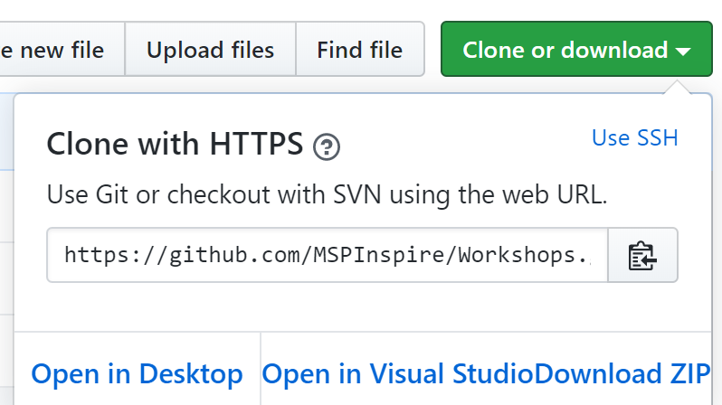

# Workshops

Welcome to the MSPInspire Workshop repository in which you can find a bunch of workshops which you can use in your own presentations from our awesome contributors!

## Who is this for?

This is for anyone who is looking for ready made content to present in workshops all around the world.

## Can I upload my content here?

Yes you can! Simply make a pull request with your content. Try to follow the structure of the repository closely. This may change as it evolves!

## How to download the content?

You can either open the content by using this quick feature from the image below, by either opening it in GitHub Desktop, or you can Download the ZIP file.



Alternatively you can do this from the command line, however you would need to have Git Bash installed if not on Mac.

```text
git clone https://github.com/MSPInspire/Workshops.git
```
