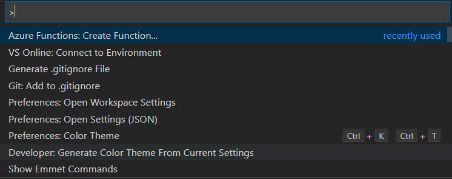
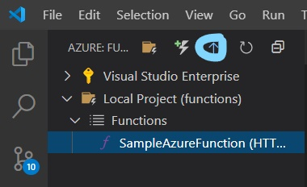

# Writing your first Azure Function using nodejs and deploying it directly to Azure using VSCode. 


While you can directly build azure functions in Azure directly here i am going to show you guys how you can do it using VS-Code and some extensions and also will show you guys how you can test them locally on your machine and deploy it directly from the VS-Code without even the need of going to Azure Portal.

First of all you will require a Azure Account and Azure Functions Extensions installed on your system.


1. After you have the extensions installed create a folder  in which you would like to create the azure function. 

Note that Azure Functions can be created in multiple languages and each of them has complete functionality but we are going to focus on creating one with NodeJs.

2. Go to that folder and open it in vs code. After opening with vs-code you can click F1 in VS-code to get commands search create a Azure Function from them. 



3. There needs to be a trigger to every azure function to run and while there are a number of triggers for every function here we are going to focus on creating a azure function from http-trigger so select that.

4. After selecting the trigger it will ask you for the language that you prefer here we are working with nodejs so we will select Javascript while if you prefer any other language you can go ahead and select that language.

Note: -

To test nodejs functions locally you would need azure-functions-core-tools installed. 

You can install it like this for v3

``` 
npm i -g azure-functions-core-tools@3 --unsafe-perm true
```

You can do the same for v2

```
npm i -g azure-functions-core-tools@2 --unsafe-perm true
```
In this tutorial we are going with v2 as it is the version that supports the nodejs version that i have on my system. You can choose v3 the working somewhat remains the same you might need to make some changes tho.

After you have installed all the tools as said and created you are ready to go and test out writing your first azure functions and then just click F5 in the VS-Code window to run it. 

Deploying this to Azure is more sweet than this. You just have to click on the Azure button on left hand side of your vscode window and it will probably show two options if you are signed into azure those two options should look like this.


From these two options click on the drop down arrow near local functions and it should show the functions which are in the current project window.

After finding your function on which you are working on you just have to right click on its name and select the option to deploy to azure inorder to deploy it to azure. It will ask you some questions such as your id for function and region you want to deploy it to after you have done that it should automatically deploy it to the azure cloud and you finally have a azure function deployed on to the cloud. Hurray.!



